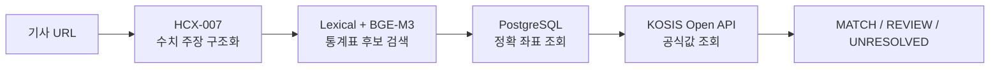

# Hi there, I'm Jeonghyeon Gu 👋

AI·NLP를 공부하고 프로젝트로 구현하며, **근거를 추적할 수 있는 AI 서비스**를 만들고 있습니다.

자연어 처리, 검색, 데이터베이스와 공식 API를 연결해 모델의 판단 과정을 관찰하고 평가할 수 있는 시스템에 관심이 있습니다. 좋은 결과뿐 아니라 실패 원인과 불확실성까지 설명할 수 있는 개발을 지향합니다.

---

## Now

- [AI·NLP Learning Notes](https://github.com/rnwjdgus03/TIL)에 딥러닝 기초부터 Transformer, RAG, CLIP까지 학습 내용을 정리하고 있습니다.
- 공식 통계와 뉴스 수치 주장을 연결하는 evidence-grounded AI pipeline을 개발했습니다.
- 검색 모델의 후보를 정형 메타데이터와 공식 API로 검증하는 구조를 탐구하고 있습니다.
- Retrieval 성능뿐 아니라 좌표 정합성, blind evaluation, 안전한 실패 정책까지 함께 평가하고 있습니다.

---

## Projects

프로젝트가 추가되어도 한눈에 비교할 수 있도록 모든 프로젝트를 같은 형식으로 정리합니다.

| Project | Area | Status | Links |
|---|---|---|---|
| KOSIS 뉴스 수치 검증 PoC | NLP · Retrieval · Backend · Evaluation | Completed | [Overview](./projects/kosis-news-verification.md) · [Repository](https://github.com/rnwjdgus03/NLP_05-Team-Project-3) · [PPTX](./assets/kosis-news-verification-final.pptx) |
| FIRE CARE | Mobile · AI Vision · Backend · PostgreSQL | In Progress | [Overview](./projects/fire-care.md) · [Repository](https://github.com/rnwjdgus03/fire-care) · [PPTX](./assets/fire-care-overview.pptx) |

### 01. KOSIS 뉴스 수치 검증 PoC

> 뉴스 기사 속 수치 주장을 KOSIS의 정확한 통계 좌표와 연결해, 공식 근거를 확보할 수 있는 범위만 자동 검증한 PoC

#### 핵심 성과

| 성과 지표 | 결과 | 평가 기준 |
|---|---:|---|
| ITEM 후보 회수 | **Top-5 77.3%** | 개발 좌표 gold 300건 |
| 전체 좌표 후보 회수 | **Top-5 74.3%** | ITEM·OBJ·기간을 포함한 개발 좌표 gold 300건 |
| 통계표 후보 Recall | **84.5% → 91.0%** | 자동 gold 200건 Recall@20, **+6.5%p** |
| 처리시간 | **193.25초 → 120.70초** | **72.55초 단축, 37.5% 개선** |
| 실제 기사 개발 E2E | **MATCH 6건 / READY 60건** | 불확실한 54건은 `UNRESOLVED` 처리 |
| URL 50건 처리 결과 | **측정값 263 → KOSIS-ready 96 → 공식 근거 11** | 단계별 검증 통과 건수 |

> **주의:** Top-k는 팩트체크 정확도가 아니라 정답 좌표가 상위 k개 후보에 포함된 비율입니다.

#### 성과를 만든 기술 적용 과정

| 달성 목표 | 적용 기술과 실행 | 성과 |
|---|---|---|
| 기사 문장을 검색 가능한 구조로 변환 | **HCX-007 Structured Outputs**로 수치·단위·기간·대상·비교 기준을 measurement 단위로 추출 | 비정형 기사에서 KOSIS 조회에 필요한 검색 조건을 구조화 |
| 표현이 다른 통계표까지 후보로 회수 | **Lexical + BGE-M3 + Reranker**로 키워드 일치와 의미 유사도를 결합 | Recall@20을 **84.5%에서 91.0%로 개선** |
| 존재하지 않는 좌표 생성 방지 | 의미 검색과 분리해 **PostgreSQL**에서 실제 ITEM·OBJ·period 조합만 조회 | LLM이 만든 가상 좌표를 차단하고 공식 API 요청 전 좌표 존재성을 검증 |
| 잘못된 자동 판정 방지 | KOSIS API preflight와 `UNRESOLVED` 정책 적용 | READY 60건 중 근거가 확보된 6건만 MATCH, 불확실한 54건은 판정 보류 |
| 반복 처리 병목 감소 | 후보 수와 API 호출 단계를 조정하고 검색 결과를 재사용 | 전체 처리시간 **37.5% 단축** |

#### 시스템 흐름

**핵심 기여:** BGE-M3 의미 검색과 PostgreSQL 정확 좌표 조회를 분리해 후보 회수 성능과 좌표 신뢰성을 각각 관리했습니다.

[상세 성과·평가·트러블슈팅](./projects/kosis-news-verification.md) · [Repository](https://github.com/rnwjdgus03/NLP_05-Team-Project-3) · [PPTX](./assets/kosis-news-verification-final.pptx)

### 02. FIRE CARE

> 현장 점검자가 설비별 공식 체크리스트를 확인하고, 사진 분석부터 보고서 전송까지 한 앱에서 처리하도록 만든 시설설비 점검 보조 서비스

#### 핵심 성과

| 성과 지표 | 결과 |
|---|---:|
| 지원 설비 | **16종** |
| DB 관리 점검 항목 | **137개** |
| 설비 일치 기준 | **70%** |
| 사진 기반 항목 판정 기준 | **75%** |
| 현장 업무 흐름 | 로그인 → 설비 선택 → 체크리스트 → AI 분석 → 보고서 생성 |
| 데이터 공유 범위 | 동일 회사 계정의 여러 휴대폰에서 건물·설비·점검 결과 동기화 |

#### 성과를 만든 기술 적용 과정

| 달성 목표 | 적용 기술과 실행 | 성과 |
|---|---|---|
| 현장 점검 절차를 모바일로 통합 | **React Native · Expo · TypeScript**로 설비 등록, 점검, 사진 촬영, 결과 확인 화면 구현 | 5단계 점검 흐름을 하나의 모바일 앱으로 연결 |
| 설비와 무관한 사진 저장 방지 | **Gemini Vision**으로 선택 설비와 사진 속 설비의 일치 여부를 먼저 검사 | 일치 기준 70% 미만 사진의 결과 저장 차단 |
| AI가 확인할 수 없는 항목의 오판 방지 | 사진 품질 검사와 근거영역 확인을 적용하고 작동시험·압력·내부 점검은 `직접 확인`으로 분리 | 항목 판정 기준 75% 미만 또는 근거영역이 없는 결과를 자동 확정하지 않도록 제한 |
| 작업자별 데이터 불일치 제거 | **Node.js · Express · PostgreSQL · JWT**로 회사, 사용자, 건물, 층, 설비, 점검 결과를 서버 저장 | 같은 회사의 여러 휴대폰에서 동일한 점검 데이터 조회 |
| 수작업 보고서 작성 축소 | 건물별 점검 결과와 인증사진을 **HTML 보고서**로 생성하고 **Gmail SMTP**로 전송 | 점검 완료 후 보고서 생성과 이메일 발송까지 앱 흐름에 통합 |
| 점검 기준의 임의 변경 방지 | 16개 설비 유형, 137개 점검 항목을 PostgreSQL 마스터로 관리 | Gemini가 점검 항목을 추가·삭제하지 못하도록 서버 기준 고정 |

#### 앱 화면 흐름

**핵심 기여:** AI가 현장 점검을 대신하도록 만들지 않고, 설비 일치·사진 품질·판정 근거를 통과한 항목만 보조 결과로 저장하도록 안전장치를 구현했습니다.

[상세 성과·안전장치](./projects/fire-care.md) · [Repository](https://github.com/rnwjdgus03/fire-care) · [PPTX](./assets/fire-care-overview.pptx)

<!-- 새 프로젝트는 아래 형식으로 추가합니다.

### 02. Project Name

> 한 줄 문제 정의

**Role · Team Size · Period · Area**

- 핵심 구현 1
- 핵심 구현 2
- 핵심 구현 3

| Key Result | Value |
|---|---:|
| Metric | Result |

[상세 내용 보기 →](./projects/project-name.md)
-->

---

## Learning & Research Interests

- Text preprocessing, tokenization, PyTorch model training
- RNN, Seq2Seq, Attention, Transformer, BERT, GPT
- Retrieval-augmented generation and evidence-grounded AI
- Lexical, dense, hybrid retrieval and reranking
- LLM evaluation, hallucination control and human-reviewable workflows
- CLIP, contrastive learning and multimodal representation

학습 노트는 [TIL Repository](https://github.com/rnwjdgus03/TIL)에서 주제별로 정리하고 있습니다.

---

## Tech Stack

### AI / NLP

### Retrieval / LLM Application

### Backend / Data

### Evaluation

---

## Repositories

- [TIL](https://github.com/rnwjdgus03/TIL) — AI·NLP 개념을 학습 흐름에 따라 정리한 노트
- [NLP_05-Team-Project-3](https://github.com/rnwjdgus03/NLP_05-Team-Project-3) — KOSIS 뉴스 수치 검증 PoC
- [FIRE CARE](https://github.com/rnwjdgus03/fire-care) — AI 기반 시설설비 점검 및 보고서 자동화 모바일 앱
