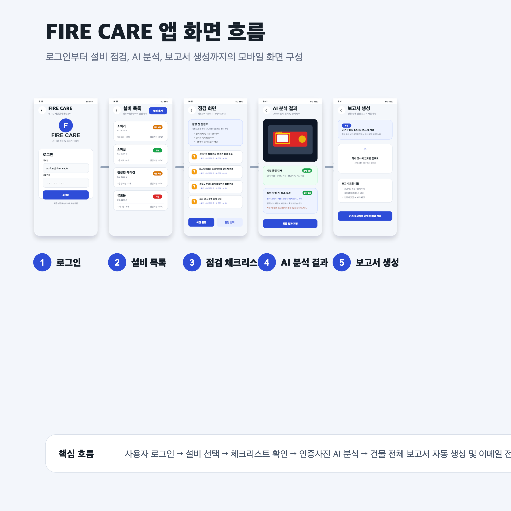

# FIRE CARE

> AI 기반 시설설비 점검 및 보고서 자동화 모바일 앱

FIRE CARE는 건물 내 소방설비와 기계설비를 모바일로 등록하고, 설비별 체크리스트 기반 점검을 수행한 뒤, 인증사진과 점검 결과를 서버 DB에 저장하는 졸업작품 프로젝트입니다.

AI는 점검자를 대체하지 않고, 사진으로 확인 가능한 항목만 보조적으로 판정합니다. 최종 점검 결과는 작업자가 직접 확인하고 저장하는 구조로 설계했습니다.



---

## Problem

현장 점검 업무에서는 설비 종류, 위치, 인증사진, 체크리스트 결과, 보고서 작성이 따로 관리되는 경우가 많습니다.

이 과정에서 다음 문제가 발생할 수 있다고 판단했습니다.

- 사진 속 설비와 사용자가 선택한 설비가 다를 수 있음
- 어둡거나 흐린 사진으로 AI가 잘못 판단할 수 있음
- 여러 작업자가 같은 건물을 점검할 때 데이터가 분산될 수 있음
- 점검 결과를 다시 보고서로 정리하는 데 시간이 소요됨

---

## What I Built

- 회원가입 및 로그인
- 관리자 / 작업자 권한 분리
- 건물, 층, 설비 등록
- 설비별 체크리스트 표시
- 점검 전 체크리스트 미리보기
- 인증사진 촬영 및 앨범 선택
- Gemini 기반 설비 일치 여부 확인
- 사진 품질 검사
- AI 판정 근거 영역 표시
- PostgreSQL 기반 점검 결과 저장
- 건물 전체 점검 보고서 자동 생성
- Gmail SMTP 기반 보고서 이메일 발송

---

## Architecture

```text
React Native / Expo Mobile App
        ↓
Node.js / Express API Server
        ↓
PostgreSQL Local Database
        ↓
Gemini Vision Analysis
        ↓
Gmail SMTP Report Delivery
```

---

## Key Design Decisions

### 1. AI는 점검자를 대체하지 않는다

AI가 법정 점검을 완료한 것처럼 보이면 책임 문제가 생길 수 있습니다.

따라서 Gemini는 사진 기반으로 확인 가능한 항목만 보조 판정하고, 작동시험·압력 측정·내부 상태처럼 사진만으로 확인할 수 없는 항목은 작업자가 직접 확인하도록 분리했습니다.

### 2. 체크리스트는 AI가 생성하지 않는다

AI가 매번 새로운 체크리스트를 생성하면 기준이 달라질 수 있습니다.

그래서 설비 종류별 체크리스트는 서버 DB에 저장하고, Gemini는 서버가 제공한 항목만 판정하도록 제한했습니다.

### 3. 저장보다 차단이 우선이다

현장 서비스에서는 잘못된 데이터가 저장되는 것이 가장 위험하다고 판단했습니다.

사진 속 설비가 선택한 설비와 다르거나, 사진 품질이 낮거나, 사용자가 직접 확인해야 할 항목이 남아 있으면 점검 결과 저장을 차단했습니다.

---

## Troubleshooting

| Issue | Risk | Solution |
|---|---|---|
| 사용자가 선택한 설비와 사진 속 설비가 다를 수 있음 | 잘못된 설비에 점검 결과가 저장되어 현장 데이터 신뢰도가 낮아질 수 있음 | Gemini가 먼저 선택 설비와 사진 속 설비의 일치 여부를 확인하고, 불일치 시 저장을 차단 |
| 어둡거나 흐린 사진으로 AI 분석이 진행될 수 있음 | 낮은 품질의 사진으로 인해 AI 오판정 또는 확인 불가 항목 증가 | 사진 품질 검사를 통해 어두움, 흐림, 원거리, 잘림 사진은 재촬영 안내 |
| 여러 작업자가 같은 건물을 점검할 때 데이터가 달라질 수 있음 | 작업자별 데이터가 따로 저장되어 관리자와 현장 작업자 간 정보 불일치 발생 | PostgreSQL 서버 DB에 사용자, 건물, 층, 설비, 점검 결과를 저장하여 여러 휴대폰에서 동일 데이터 동기화 |

---

## Skills & Tech Stack

### Mobile

- React Native
- Expo
- TypeScript
- Expo Image Picker
- Expo SecureStore

### Backend

- Node.js
- Express
- PostgreSQL
- JWT Authentication
- bcrypt password hashing

### AI / Automation

- Gemini Vision API
- Image quality validation
- Equipment-image matching
- Evidence region visualization

### Report / Delivery

- HTML report generation
- Gmail SMTP
- Building-level inspection report
- Photo-based inspection evidence

### Engineering Skills

- API design
- Database schema design
- Authentication and role separation
- Data synchronization
- Error handling and retry UX
- Troubleshooting Expo SDK and network environment issues

---

## Result

FIRE CARE는 단순히 AI 분석을 붙인 앱이 아니라, 현장 업무에서 문제가 될 수 있는 데이터 신뢰성, 사진 품질, 설비 불일치, 다중 작업자 동기화 문제를 중심으로 구조를 개선한 프로젝트입니다.

특히 AI의 역할을 제한하고, 최종 판단은 작업자가 수행하도록 설계하여 실무 환경에서 더 안전하게 사용할 수 있는 점검 보조 흐름을 구현했습니다.
